# 损失函数和优化

## 损失函数

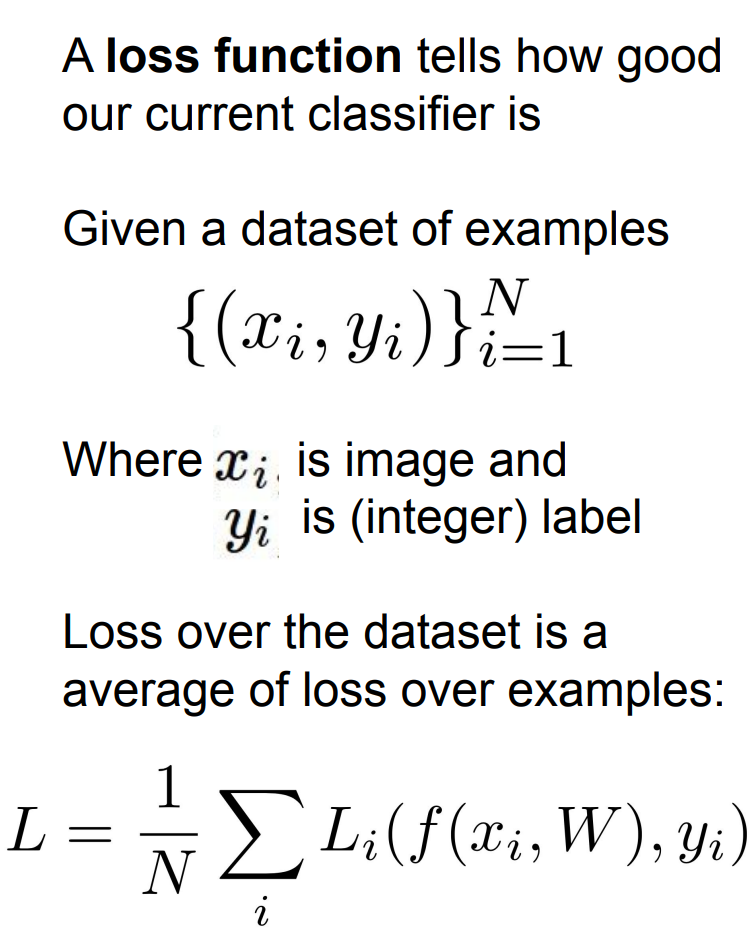

两种计算损失函数的方法：SVM、Softmax

### SVM损失函数

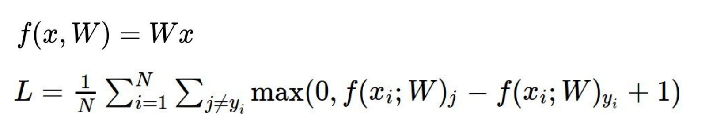

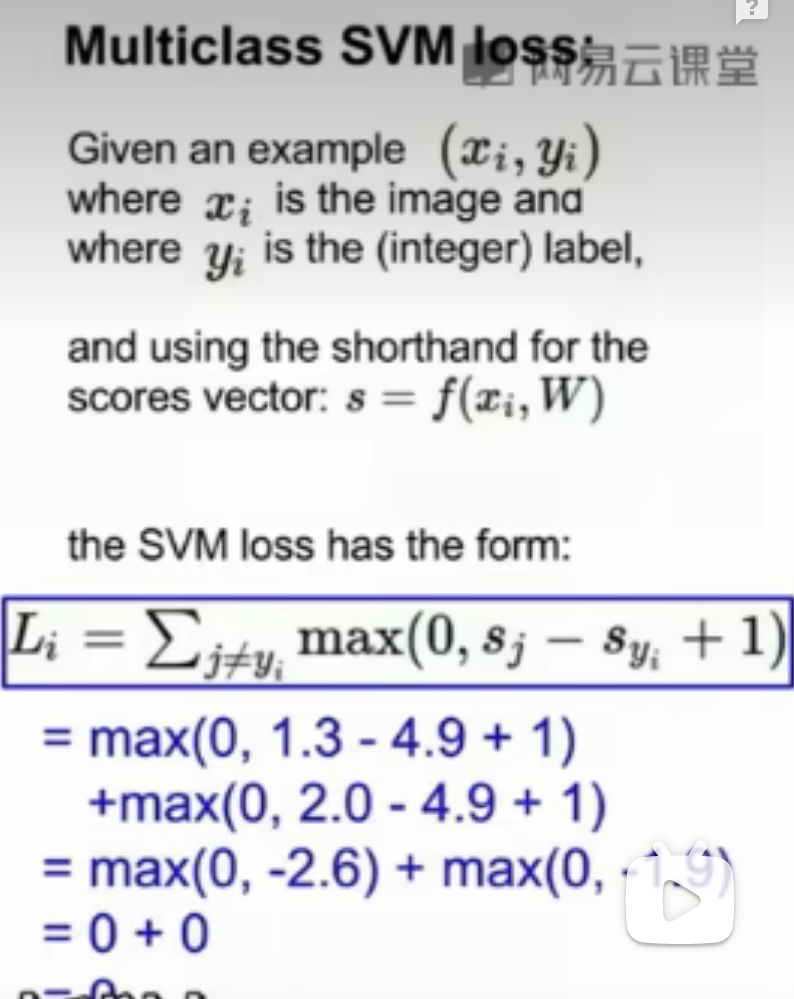

- 通常计算损失函数的平均值

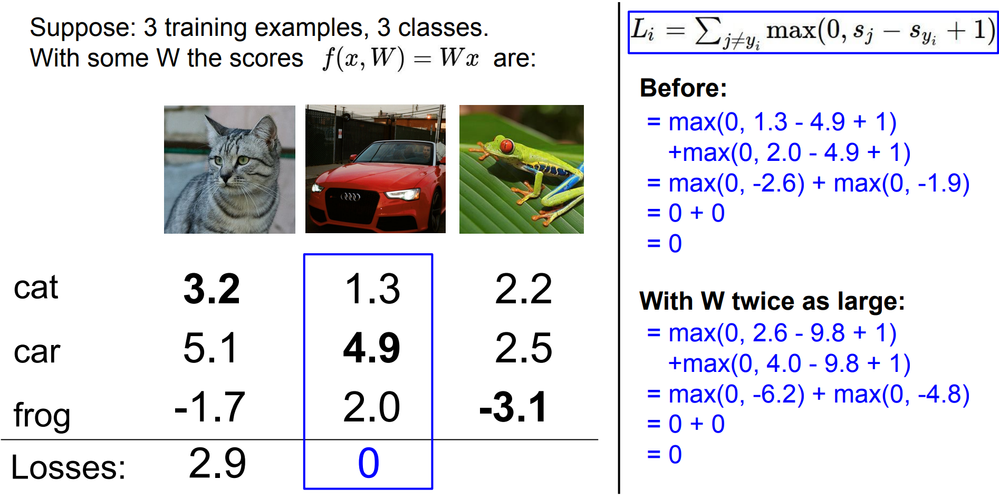

- SVM损失函数只关注正确分类的概率比未正确分类的概率大1，只要大1，损失函数就觉得此时的损失为0。所以w扩大几倍后，L仍然为0。

- 令L为0的Wi的值不是唯一的。

#### 铰链损失（hinge loss)函数

Sj（正确分类的分数）越大，Syi（错误分类的分数）越小，当Sj比Syi大的超过1后，L（损失函数值）就一直为0

- 平方损失函数：平方项可以放大错误，对正确率要求高，可以使用；

#### 正则化

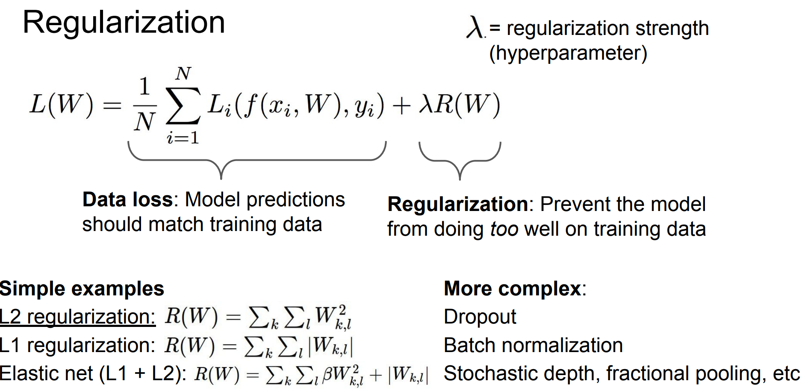

含义与机器学习课程里的一样，都是为了减少过拟合

L1正则后就是稀疏矩阵，得到w1;L2倾向于让所有系数缩小，得到w2

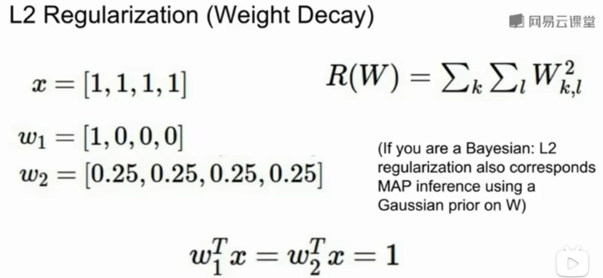

### Softmax Calssifier

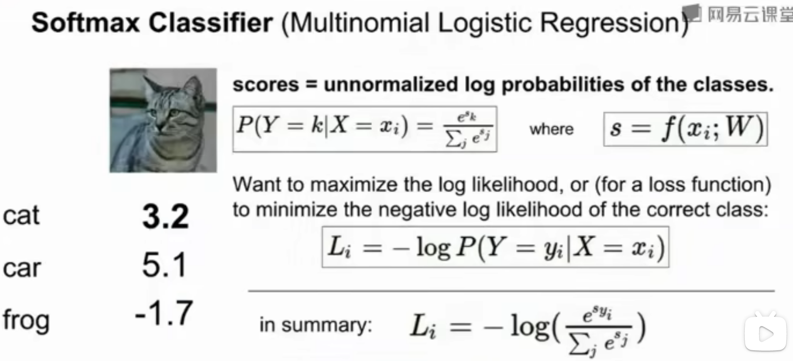

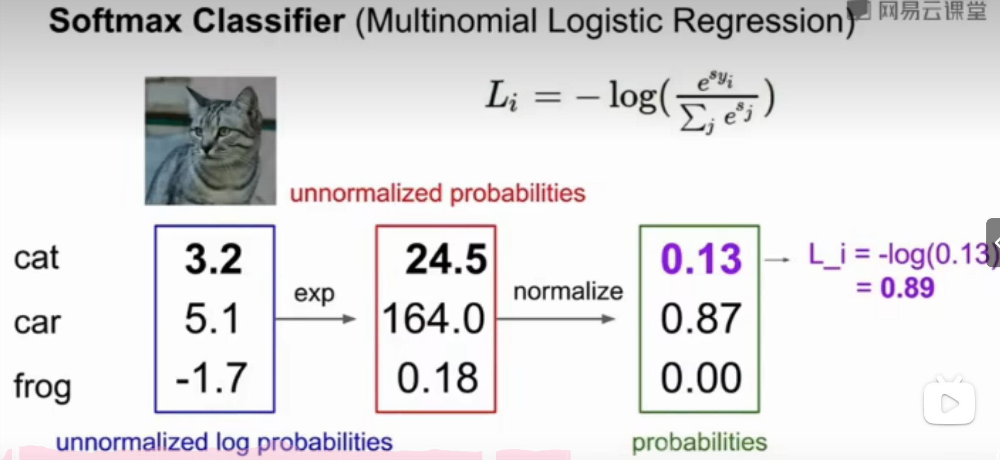

逻辑斯蒂回归 :指数化——》归一化

Li的最小值是0（归一化后正确分类的概率是1，其他分类是0，-log(1/1) = 0）

最大值是趋向正无穷（归一化后正确分类的的概率是0，-log(0/1) = +∞)

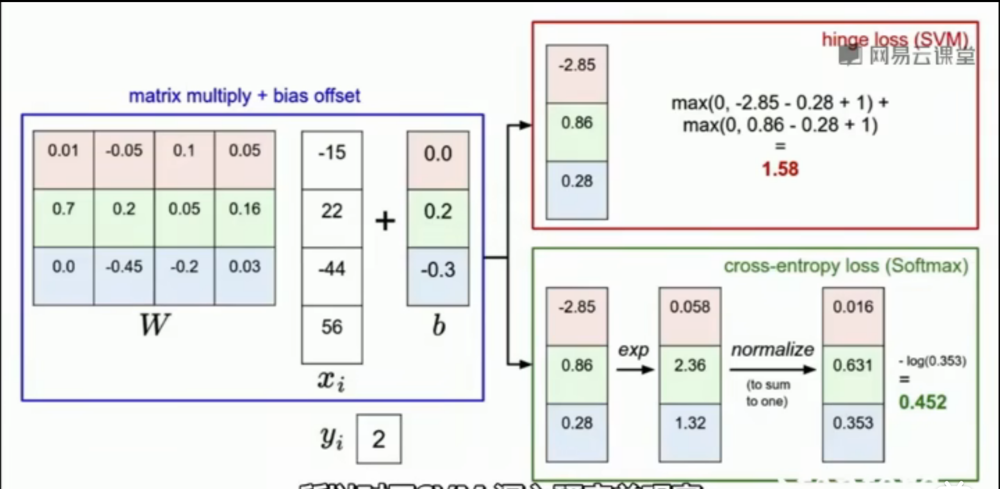

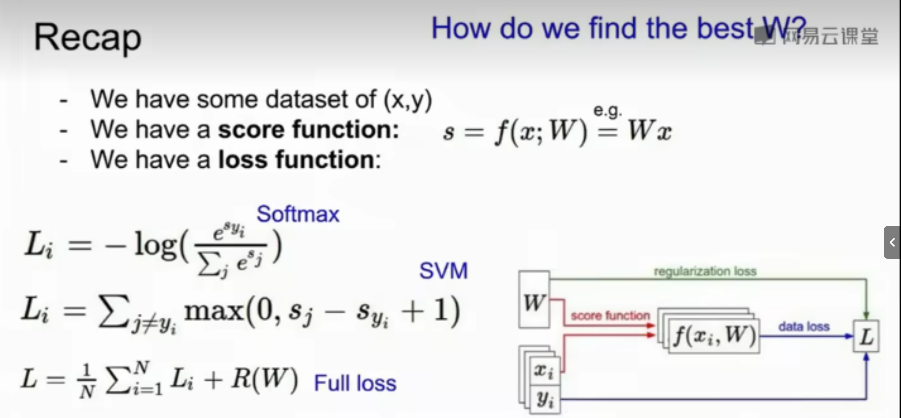

## 优化

### 梯度下降

利用每一步的梯度，计算下一步的方向，来获得是损失函数最小的一组w权重（线性分类器每一行每一个像素点的值）的值

梯度上升的方向是指函数值增大的方向，因此梯度下降的方向（梯度上升的反方向）就是函数值下降的方向

#### 有限差分法 finite difference

计算量大

当N非常大的时候，需要对每个w进行迭代，计算量非常大

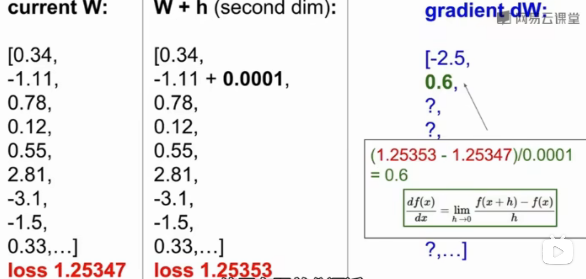

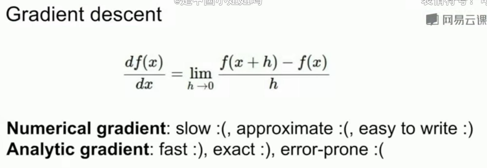

#### 随机梯度下降 stochastic gradient descent

不是计算整个训练集的误差和梯度值，而是在每一次迭代中，随机选取一小部分训练成本，成为minibatch(小批量)，一般取2的n次方，来计算误差和梯度值；可以看作是对真是数值期望的一种蒙塔卡洛估计

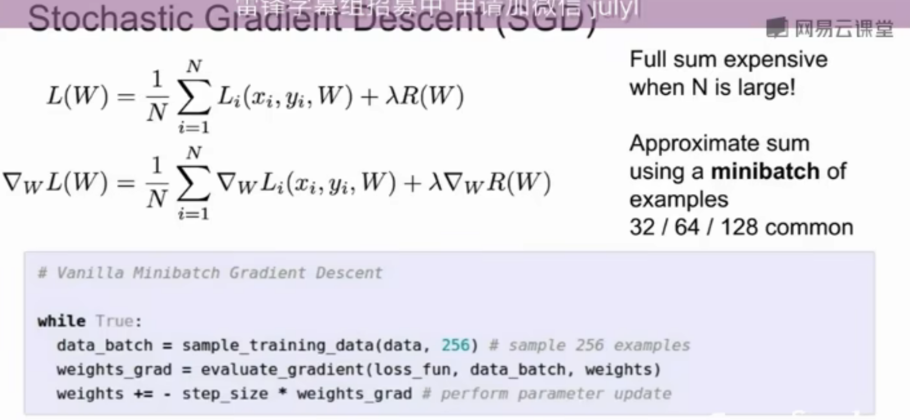

### 图像特征

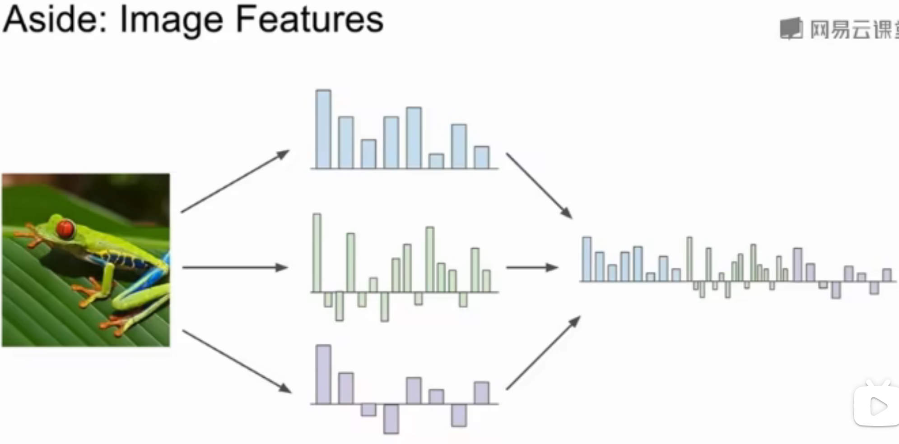

#### 特征转换

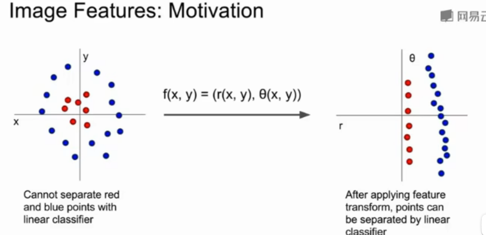 

转换后（这里使用极坐标转换）可以使用线性分类器画出决策边界

# 反向传播 计算任意复杂函数的梯度

##  计算图computational graph

## 反向传播技术backpropagation

递归地调用链式法则来计算计算图中每个变量的梯度

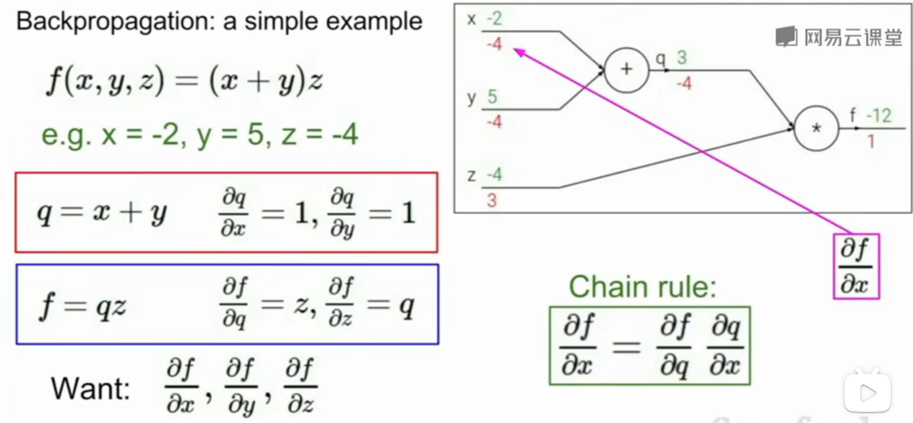

右侧计算图上面绿色的数字表示向前计算的数值，下面红色的数字表示反向计算时得到的梯度值

在每一个节点上计算我们所需的本地梯度，然后跟踪这个梯度。在反向传播过程中，我们接收从上游传回来的这个梯度值，这个值再乘以本地梯度，就得到想要传回连接点的值。在下一个节点进行反向传播时，不考虑除了直接相连的节点之外的任何东西

例子：

上游传回来的梯度值乘以本地梯度值，其中本地梯度值中的x指这个节点接收的数值

-0.53 = 1 * (-1/(1.37)²)

- 1 上游传回来的梯度值
- (-1/(x)²)本地梯度值
- 1.37 这个节点接收的x的值

尽量把计算图写成简单的形式，即每个节点最多只有两个输入

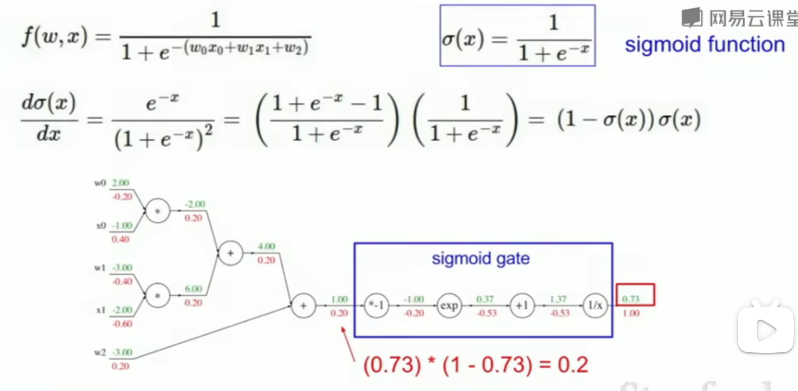

由这个图可知，可以把计算图分解成比较大的点计算，也可以把它分解成所有这些更小的计算节点

### Patterns in backward flow

- **加法门add gate:**

梯度分布器gradient distributor

通过加法门，连接了两个分支，获取上游梯度并分发和传递完全相同的梯度给相连接的两个分支

- **最大门max gate**

可以看作路由转换器

最大的那个值的梯度是上游传来的所有梯度值，另一个值的梯度为0

- **乘法门mul gate**

可以看作梯度转换器，尺度缩放器

获取上游梯度，根据另一个分支的值对其缩放

### 向量计算

向量计算流程还是一样的，唯一区别在于梯度变成了雅可比矩阵

雅可比矩阵：包含了每个变量里每个元素导数的矩阵，矩阵的每一行都是偏导数，矩阵的每个元素是输出向量的每个元素对输入向量每个元素分别求偏导的结果；而输出的第i个元素只与输入的第i个元素有联系，所以输出的第i个元素对其他元素求导都为0，因此雅可比矩阵是个对角矩阵，只有对角线上有数值，不为0

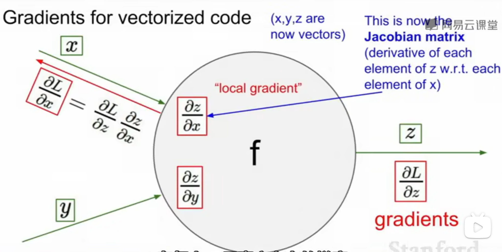

### 模块化操作

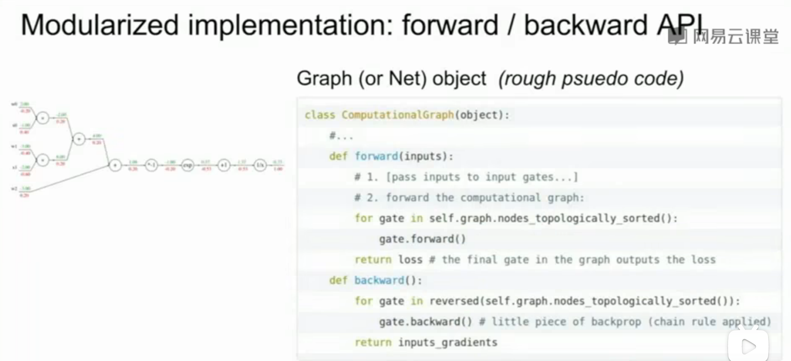

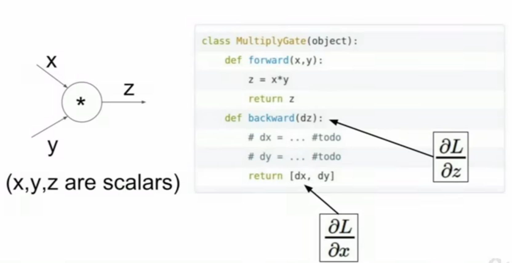

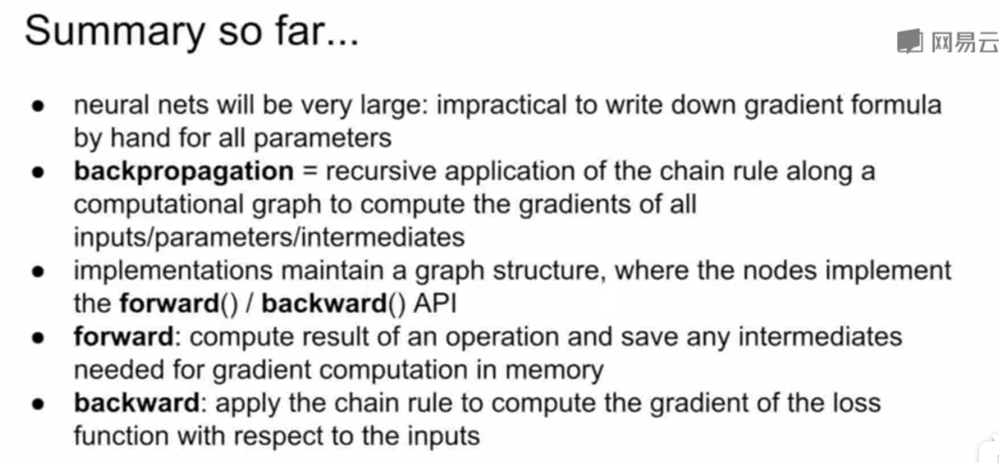

# 神经网络

神经网络就是由简单函数构成的一组函数在顶层由一种层次化的方式堆叠在一起，形成了一个更复杂的非线性函数

基本的多阶段分层计算

W1是像之前一样用来寻找的模板，W2是这些得分的加权，h是Max(0,W1*x)的值

举例：

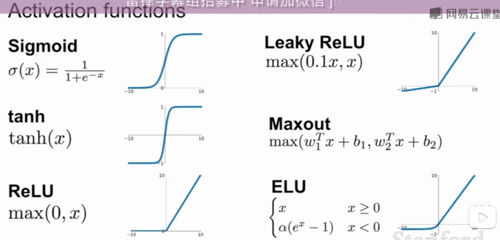

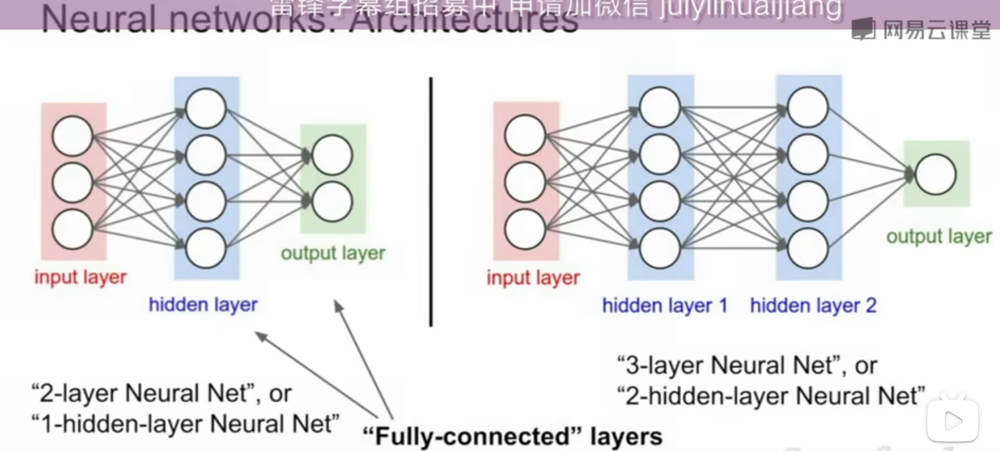

左侧图：全连接层，两层神经网络，或单隐藏层神经网路

右侧图：全连接层，三层神经网络，或双隐藏层神经网络

可以把每层隐藏层神经网络看作一组向量，一组神经元的集合，利用矩阵乘法来计算神经元的值

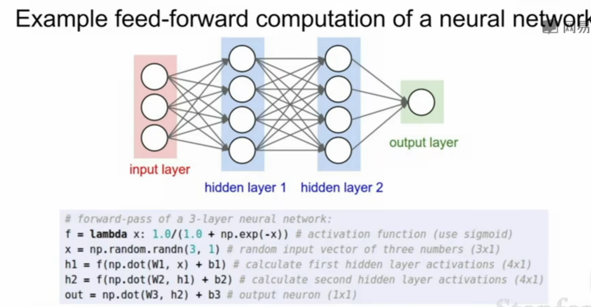

# 卷积神经网络

**Convolutional Neural Networks**

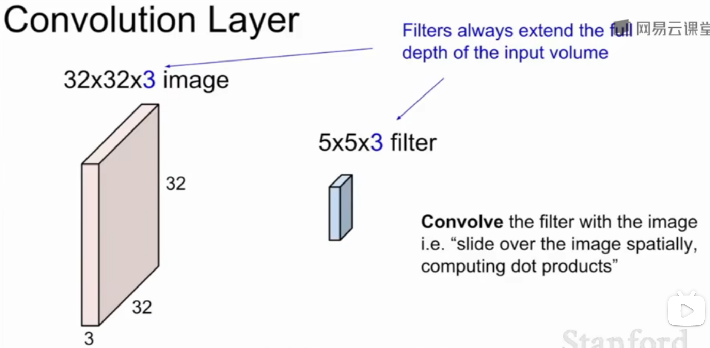

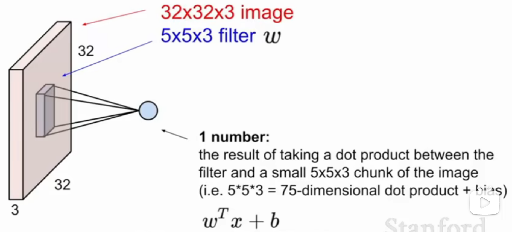

卷积核遍历整个图像进行点积计算，也就是将卷积核每个位置元素和与之对应图像区域的像素值相乘然后相加 

这里的WT不完全是w的转置，这只是一个表示方法，是为了让数学运算按照点积的方式进行

通过pytorch或者numpy等，将一个5*5*3的向量扩展为一个一维的，然后进行转置，再进行向量的点积即可

这里做的是向量点积，如果w不展开的话就是做的矩阵内积了

所以这里的卷积核W实际上是向量，而不是矩阵

不同卷积核提取不同的特征

向量点积与两个向量的夹角余弦值成正比，点积越大，夹角越小，向量越相似。也就是矩阵点积结果越大，特征越相似，激活函数就是添加非线性。

卷积核的通道数确实要和输入通道数一样，都是3，这里是卷积核的个数，经过一个卷积核，输出的是2维的，因为是用了多个卷积核，所以就是三维了

因为卷积核是三通道的，就是综合三通道算出来一个数字，所以压缩成单通道了

图像是7X7X3,那么卷积核必须是NXNX3的，这样一个核去做点乘的时候会得到一个数，有几个核就会得到几个数，然后所有的核再滑移

零填充的目的是保证图像尺寸再卷积后仍不变，更多地保留边缘值

3×3：填充宽度为1

5×5：填充宽度为2

7×7：填充宽度为3

如果不进行边缘填充的话：

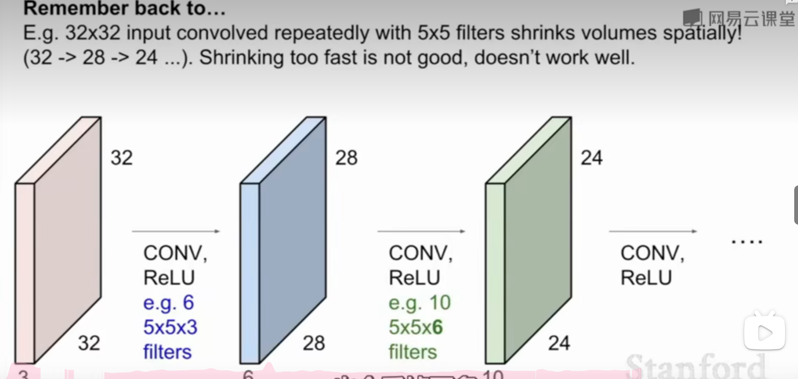

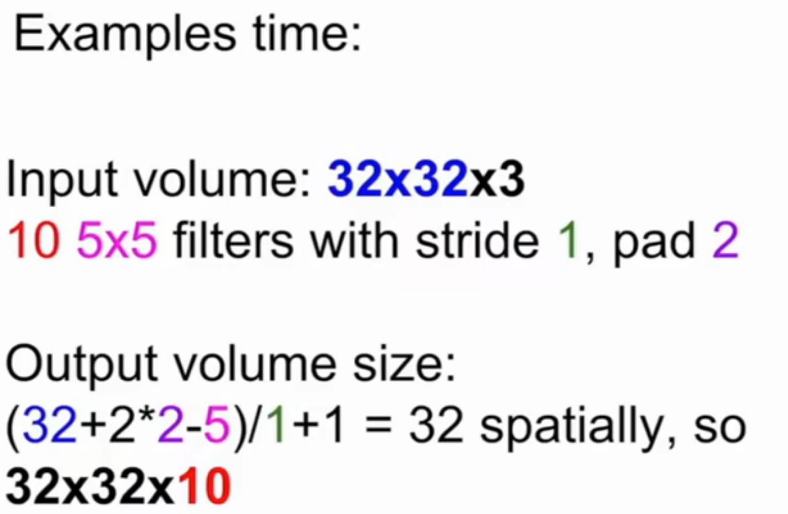

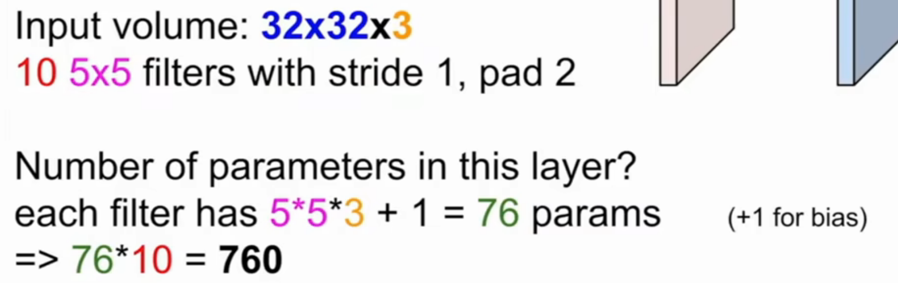

步长较大时，获得和降采样处理图片相同的效果

### 视觉之外的卷积神经网络

