# 训练神经网络

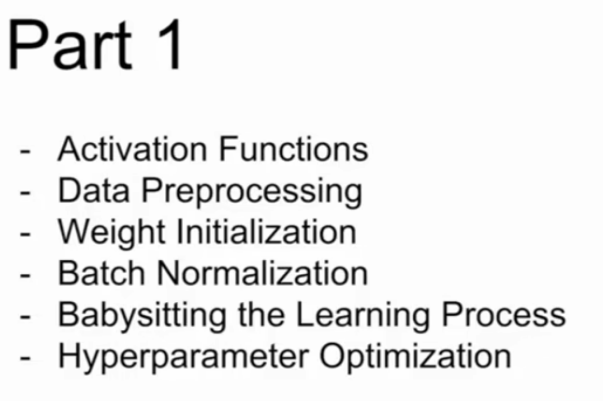

Activation Funcations激活函数

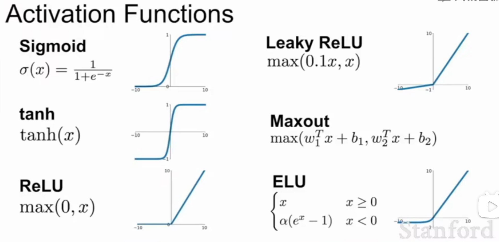

sigmoid函数缺点：梯度消失、值恒大于零不够灵活（不满足零中心）、含有指数项计算量大

- 饱和神经元使梯度消失：当输入值特别小或大时，梯度值就无限接近于零，由链式法则反向传播，零梯度就会传递到下游的节点，即梯度就会消失

- 关于w的梯度是局部梯度(x)乘上L回传的梯度，局部梯度恒正，L回传的梯度有正有负，则w的梯度要不全为正，要不全为负，这样

​	即所有的w的梯度只能同时为正或为负

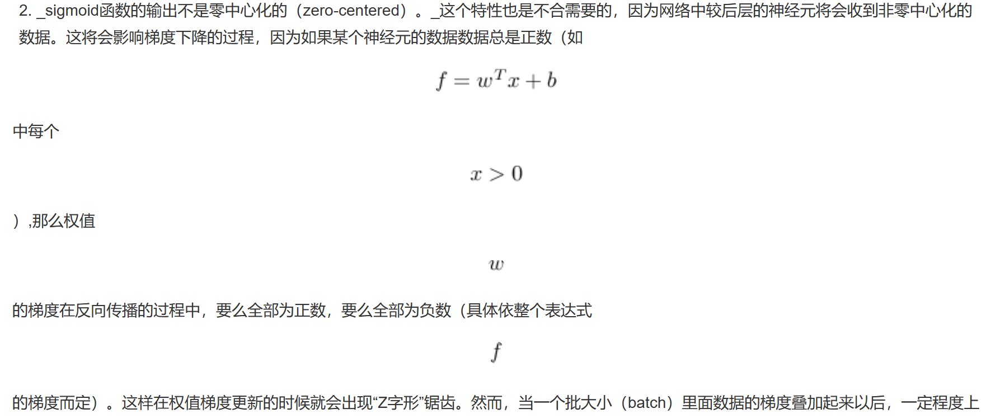

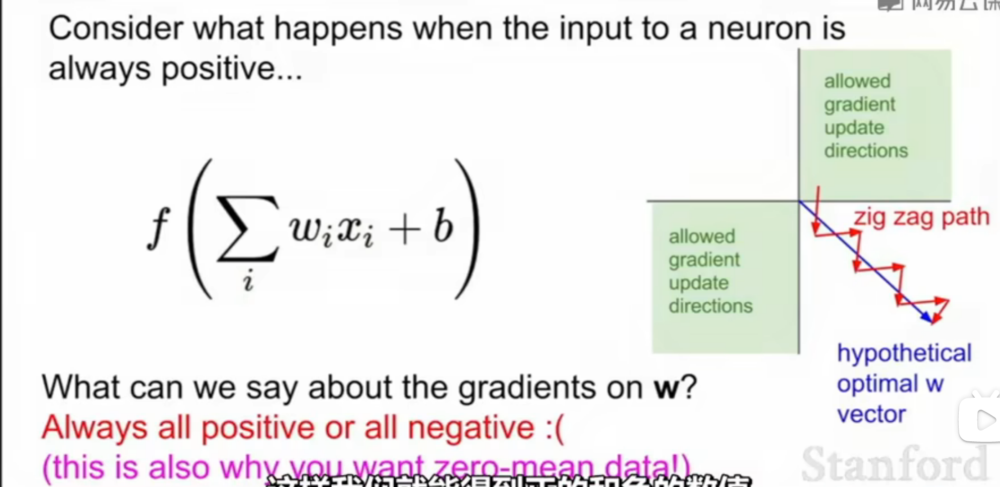

​	当进行梯度更新的时候，若L值为负，则w的梯度为负，若L值为正，即w的梯度为正；

​	这样梯度下降的方向只能是沿第一象限或第三象限，所以w更新的效率太低

- 指数计算的代价会稍微高一点（不是主要问题，卷积和点积的计算代价更大）

  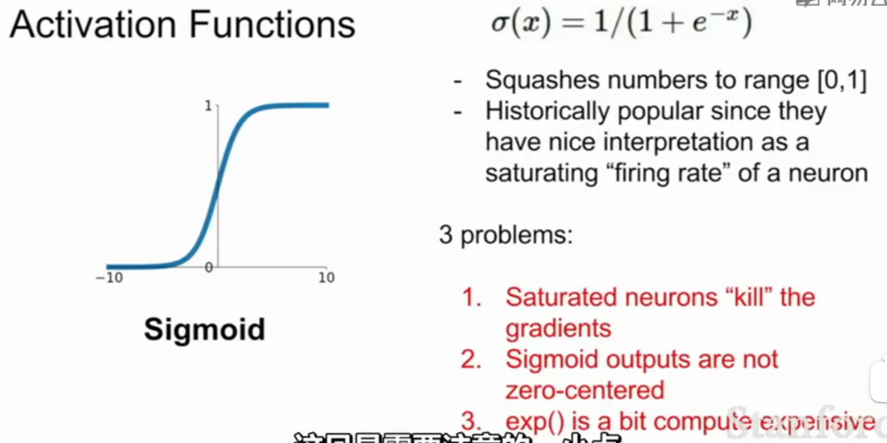

其他激活函数：

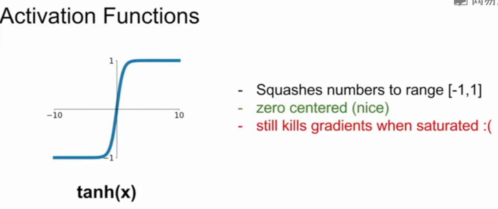

- 满足零中心（zero-centered），有梯度消失

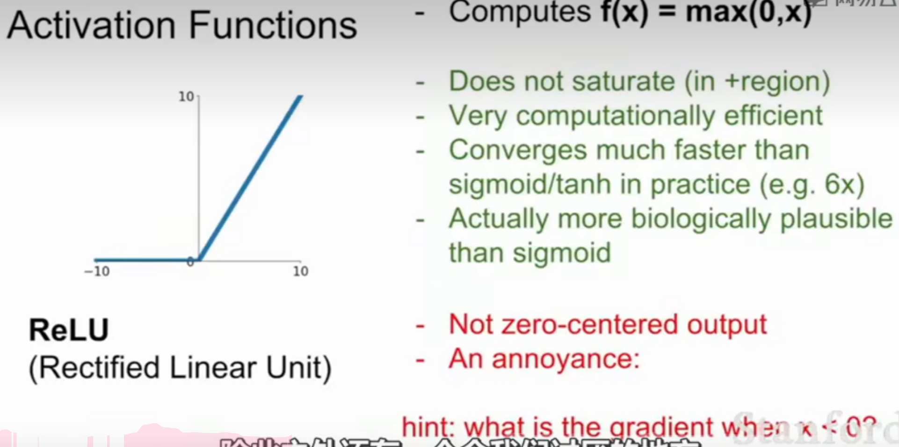

ReLu优点：

- 右半部分没有梯度消失/梯度饱和
- 收敛速度更快

缺点：

- 不满足零中心
- 左边恒为零，梯度饱和，那么如果初始W设置得不大好，导致输出全是小于0的，这样激活函数的输出值全是0，反向求导的时候也全是0，不会进行梯度更新

对于不同的权重对应不同的分割超平面，数据经过加权后输入RELU，通过超平面将空间分割为0和非0区域，不同的RELU训练得到的分割超平面也相应不同

当数据云（即所有输入样本构成的集合）全部处于某个神经元对应直线的下方时，将导致无论输入哪个样本都无法使神经元的输出为正，因此该神经元在训练过程中将一直无法更新，所以说数据dead了

所以人们倾向于使用较小的权重来初始化ReLu，偏差值大多时候初始化为0，来增加它在初始化时被激活的可能性

改进的ReLu函数：

  

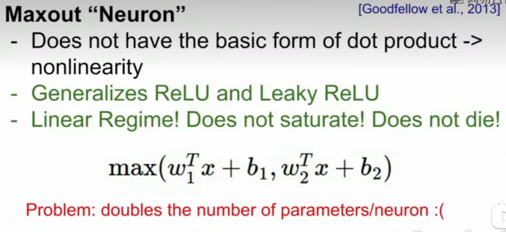

总结：

激活函数的目的是制造非线性差异，但也要兼顾计算量、导数大小及连续性、神经元死亡等问题

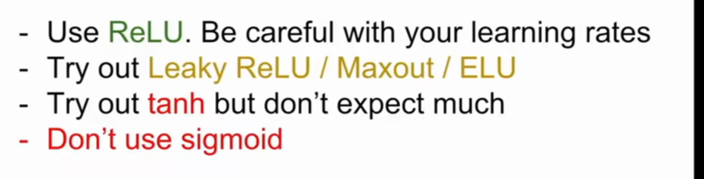

通常使用ReLu，可尝试使用其他函数，不会使用sigmoid

## Data Preprocessiong预处理

数据预处理：

 归一化

零均值化

原因：

在归一化  之前，分类器对数据的微小扰动特别敏感，所以网络权重矩阵的微小摄动。就会造成该层输出的巨大摄动

对训练集和测试集的数据做同样的预处理

权重预处理：

当所有权重值都为0时，相当于所有神经元都相同

初始化权重过小的时候，更新缓慢，网络崩溃

过大的时候，梯度饱和

 解决办法：使用Xavier初始化

## 批量归一化Batch Normalization

比较清晰的解释：[博文](https://blog.csdn.net/Yasin0/article/details/93379629)

 对输入数据进行标准化处理的原因？

使输入数据各个特征的分布相近：

神经网络学习的本质就是学习数据的分布，如果训练数据与测试数据的分布不同，那么网络的泛化能力也大大降低；
在使用小批量数据对神经网络进行训练时，若每批训练数据的分布各不相同，网络在每次迭代都去学习适应不同的分布，这会大大降低网络的训练速度；
为什么要使用批量归一化？

使用浅层模型时，随着模型训练的进行，当每层中参数更新时，靠近输出层的输出较难出现剧烈变化。对深层神经网络来说，随着网络训练的进行，前一层参数的调整使得后一层输入数据的分布发生变化，各层在训练的过程中就需要不断的改变以适应学习这种新的数据分布。所以即使输入数据已做标准化，训练中模型参数的更新依然很容易导致后面层输入数据分布的变化，只要网络的前面几层发生微小的改变，那么后面几层就会被累积放大下去。最终造成靠近输出层输出的剧烈变化。这种计算数值的不稳定性通常令我们难以训练出有效的深度模型。如果训练过程中，训练数据的分布一直在发生变化，那么将不仅会增大训练的复杂度，影响网络的训练速度而且增加了过拟合的风险。

在模型训练时，在应用激活函数之前，先对一个层的输出进行归一化，将所有批数据强制在统一的数据分布下，然后再将其输入到下一层，使整个神经网络在各层的中间输出的数值更稳定。从而使深层神经网络更容易收敛而且降低模型过拟合的风险。

批量归一化的优势：

不加批量归一化的网络需要慢慢的调整学习率时，网络中加入批量归一化时，可以采用初始化很大的学习率，然后学习率衰减速度也很大，因此这个算法收敛很快。
BN可以大大提高模型训练速度，提高网络泛化性能。
数据批量归一化后相当于只使用了S型激活函数的线性部分，可以缓解S型激活函数反向传播中的梯度消失的问题。
深层神经网络在做非线性变换前的激活输入值，随着网络深度加深或者在训练过程中，其分布逐渐发生偏移或者变动，整体分布逐渐往非线性函数的取值区间的上下限两端靠近，这会导致反向传播时低层神经网络的梯度消失，BN就是通过一定的规范化手段，把每层神经网络任意神经元这个输入值的分布强行拉回到均值为0方差为1的标准正态分布，使得激活输入值落在非线性函数对输入比较敏感的线性区域，其对应的导数远离导数饱和区 ，这样输入的小变化就会导致损失函数较大的变化，避免梯度消失问题产生，学习收敛速度快，能大大加快训练速度。

全连接层如何使用批量归一化？

将批量归一化层置于全连接层中的仿射变换和激活函数之间。设全连接层的输入为u，权重参数和偏差参数分别为W和b，激活函数为ϕ，批量归一化的运算符为BN。那么，使用批量归一化的全连接层输出为

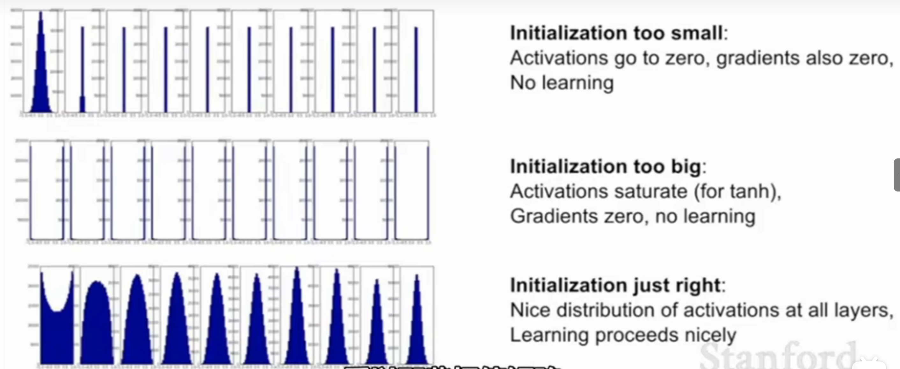

## 超参数搜索hyperparameter search：

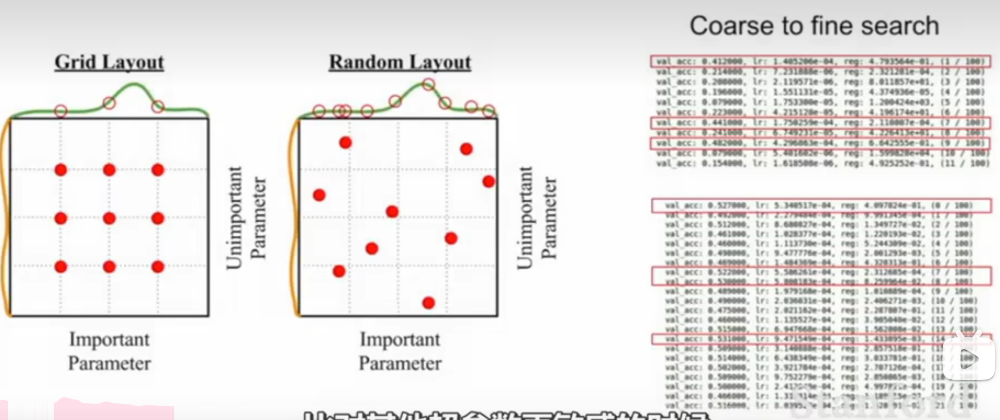

### **· 试错法（Babysitting）**

纯手工操作，设计了一个实验后，遵循学习过程的所有步骤（从数据收集到特征图映射的可视化），然后在超参数上依次迭代直到时间终止。

### **· 网格搜索（Grid Search）**

网格搜索，是一种简单尝试所有可能配置的方法。
它的工作流程是这样的：
**·** 定义一个N维的网格，其中每一个映射都代表一个超参数，例如，n＝（learning_rate, dropout_rate, batch_size）
**·** 对于每个维度，定义可能的取值范围: 例如，batch_size = [4, 8, 16, 32, 64, 128, 256]
**·** 搜索所有可能的配置，等待结果以建立最佳配置: 例如，*C1* = (0.1, 0.3, 4) ->acc = 92%, *C2* = (0.1, 0.35, 4) ->acc = 92.3%···
下图说明了一个简单的二维网格搜索的Dropout Rate和Learning Rate。

并行执行两个变量的网格搜索

这种策略没有考虑到计算背景，但这意味着可用的计算资源越多，那么同时可以尝试的猜测就会越多。它的痛点被称为维度灾难，意思是我们增加的维度越多，搜索就会变得越困难，最终导致策略失败。

### **· 随机搜索（Random Search）**

网格搜索和随机搜索之间唯一的区别在于策略周期的第一步：随机搜索在配置空间上随机选择点。

网格搜索vs随机搜索

通过在两个超参数空间上搜索最佳配置来对比这两种方法，并假定一个参数比另一个参数更重要。深度学习模型，如前面所说，实际上包含许多超参数，通常研究者知道哪些对训练影响最大。
在网格搜索中，即使我们已经训练了9个模型，但给每个变量只使用了3个值，然而，在随机搜索中，多次选择相同变量的可能性微乎其微。如果用第二种方法，那么就会给每个变量使用9个不同的值来训练9个模型。
上图中，从每个布局顶部的空间搜索可以看出，使用随机搜索更广泛地研究了超参数空间，这将帮助我们在较少的迭代中找到最佳配置。
总之，如果搜索空间包含3到4个维度，则不要使用网格搜索。相反，使用随机搜索，则会为每个搜索任务提供了一个非常好的基线。

​                                                                                              网格搜索与随机搜索的利弊

不幸的是，网格搜索和随机搜索有一个共同的缺点：“每个新的猜测都独立于之前的运行！”
相比之下，Babysitting的优势就显现出来了。Babysitting之所以有效，是因为研究者有能力利用过去的猜测，将其作为改进下一步工作的资源，来有效地推动搜索和实验。

### **· 贝叶斯优化（Bayesian Optimization）**

贝叶斯策略建立了一个代理模型，试图从超参数配置中预测我们所关注的度量指标。在每一次的迭代中，我们对代理会变得越来越有信心，新的猜测会带来新的改进，就像其它搜索策略一样，它也会等到耗尽资源的时候终止。

​                                                                                  贝叶斯优化工作流程

使用先前对损失**f**的观察结果，以确定下一个(最优)点来抽样**f**。该算法大致可以概括如下。

1. 使用先前评估的点X1*:n*，计算损失f的后验期望。
2. 在新的点X的抽样损失f，从而最大化f的期望的某些方法。该方法指定f域的哪些区域最适于抽样。

重复这些步骤，直到满足某些收敛准则。

- 交叉验证策略

- ### 粗细粒交叉搜索（coarse to fine search）

进行超参数优化时，一开始可能会处理很大的搜索范围，几次迭代后就可以缩小参数范围，圈定合适的超参数所在的范围，然后再对这个小范围重复过程

初始范围应该足够宽到网络不会超过范围的任一边

## Fancier optimization

SGD随机梯度下降算法的问题：

- 方向分配不均

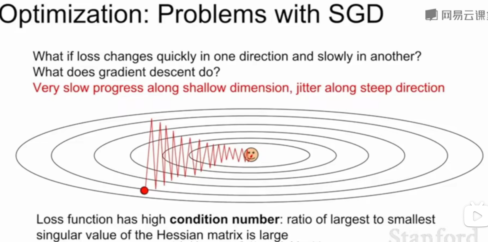

- 存在局部极小值和鞍点

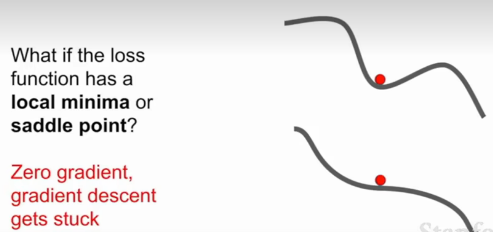

高维度计算时出现鞍点，意味着某些方向上损失会增加，某些方向损失会减少，

高维度鞍点更常见，而出现局部极小值（全部方向损失都会增加）的情况反而更少遇到

## Regularization

## Transfer Learning

