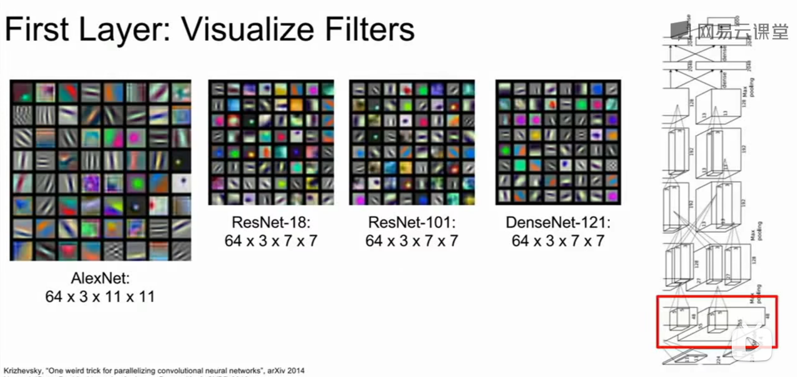

# 可视化和理解

> CNN 中有着数以千计的卷积滤波器。深度神经网络中不同的滤波器会从输入图像中提取不同特征表示。
>
> 己有的研究表明低层的卷积核提取了图像的低级语义特性（如边缘、角点），高层的卷积滤波器提取了图像的高层语义特性（如图像类别）。
>
> 但是，由于深度神经网络会以逐层复合的方式从输入数据中提取特征，我们仍然无法像Sobel算子提取的图像边缘结果图一样直观地观察到深度神经网络中的卷积滤波器从输入图像中提取到的特征表示。

## 对卷积网络各层的理解

### 第一个卷积层

几乎所有的网络第一个卷积层的卷积核的权重可视化后都是如图所示的有向边和明暗相反的颜色，和动物视觉系统开始部分组织的功能很接近。

可以把第一层的所有卷积核可视化来描述卷积层在原始图像匹配和关注什么。

可视化卷积核的背后原理是，卷积就是卷积核与图像区域做内积的结果，当图像上的区域和卷积核很相似时，卷积结果就会最大化。我们对卷积核可视化来观察卷积层在图像上匹配寻找什么。

## 中间层

对中间网络的卷积层做可视化理解可解释性比较差

例如第一个卷积层使用16 个 7 × 7 × 3的卷积核，第二层使用 20个 7 × 7 × 16的卷积核。由于第二层的数据深度变成 16维，不能直接可视化。一种处理方法是对每个卷积核画出 16 个 7 × 7 的灰度图，一共画 20 组。

即把中间网络卷积层的每个核权重展开成灰度图。

然而第二层卷积不和图片直接相连，是对第一层卷积的结果进行处理，所以卷积核可视化后并不能直接观察到有清晰物理含义的信息。

